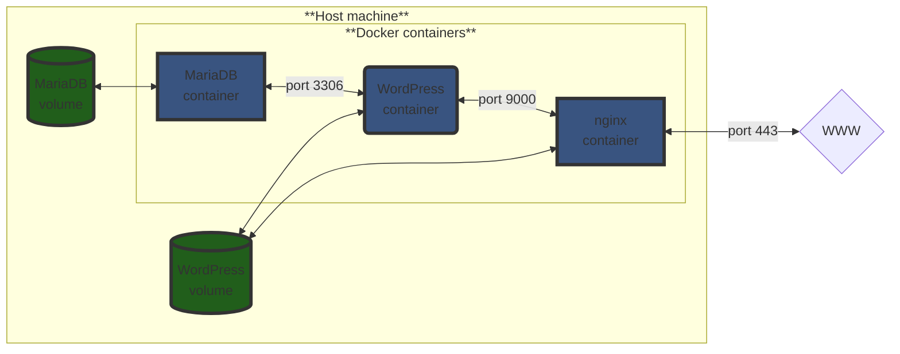

# INCEPTION

This is a project in the curriculum of Hive Helsinki / the 42 network. The main goal of this was to learn about docker and containers. The end result is a website.

## How to use

You will need sudo permissions to use this program. If it is not available to you, you will need to set up a virtual machine first.

1. Make sure that docker is installed on your system. If it is, using the following command should behave like this:

```bash
$ docker --version
Docker version 26.1.4, build 5650f9b
```

2. Then, add your user to the "docker" group:

```bash
$ sudo usermod -aG docker $USER
```
(If the docker group does not exist, you can create it with the below command:)

```bash
$ sudo groupadd docker
```

3. Clone this repository, navigate inside it, and use the 'make' command

```bash
$ git clone git@github.com:Lisly25/Inception.git Inception && cd Inception && make
```

The start-up process will take some time. You might also be prompted to enter your password. This is required to create the directory to hold the volumes for the mariadb and wordpress containers, and add the domain name to the /etc/hosts file

4. The website can now be visited at https://skorbai.42.fr (Note that even after step 3. finishes, it might take some time for the website to become available)

Note for usage on Windows/WSL:

For the domain name to be recognized, this line has to be added to ` c:\windows\system32\drivers\etc\hosts `

```
	127.0.0.1	skorbai.42.fr
```

## How to stop the program

### Suspending the program

Use the 'make down' command at the root of the repository

```bash
$ make down
```

This will just execute the docker compose down command. The wordpress website's files and the database contents will persist

### Remove the volumes

Using the 'make clean' command at the root of the repository will suspend the program, and removed the website files as well as the database contents (by removing the docker volumes from the host machine)

```bash
$ make clean
```

### Complete clean-up

Use the 'make fclean' command at the root of the repository to remove all files that the program added, reclaiming all memory that has been used

```bash
$ make fclean
```

## About the project

The fundamental idea is that the website is ran with the help of three docker containers. One of them is responsible for handling the database, another is for creating the wordpress website, while the third is hosting the website with nginx.

The database and the wordpress website's files mustn't be lost every time the system is restarted, so they are stored in docker volumes



### Docker compose file

Since the program requires three containers to work together, a docker compose was used to set it up.

The three containers are configured as three services. 

```yml
services:

	mariadb:
		container_name: mariadb
		build:
			context: ./requirements/mariadb
			dockerfile: Dockerfile
		image: mariadb:skorbai #The tag is important - otherwise, the official image would be pulled from dockerhub
		expose: #With this rule, the port is only exposed inside the docker network
			- 3306
		env_file:
			- ".env"
		volumes:
			- DB:/var/lib/mysql
		networks:
			- inception_network #All three services will be part of this
		restart: always
```

```yml
	wordpress:
		container_name: wordpress
		build:
			context: ./requirements/wordpress
			dockerfile: Dockerfile
		image: wordpress:skorbai
		expose: #With this rule, the port is only exposed inside the docker network
      		- "9000"
		depends_on: #Determines the startup order of the containers
			- mariadb
			- nginx
		env_file:
			- ".env"
		volumes:
			- WordPress:/var/www/html
		networks:
			- inception_network
		restart: on-failure
```

```yml
	nginx:
    container_name: nginx
    build:
      context: ./requirements/nginx
      dockerfile: Dockerfile
    image: nginx:skorbai
    ports:
      - "443:443" # Since we want to be able to connect to this container from outside the docker network, it's important to bind it to a host port. Note that the "port" rule is used, not "expose"
    env_file:
      - ".env"
    volumes:
      - WordPress:/var/www/html
    networks:
      - inception_network
    restart: on-failure
```

The network doesn't require configuration (bridge is already the default driver), but it is important to declare it in the docker compose file

```yml
	networks:
  		inception_network:
    		driver: bridge

```

For the volumes, we are specifying that they should be located in a specific directory within the host machine. This setup ensures that the contents are also copied back to the host (the ownership of teh volume directory also needs to be set with chown in the dockerfile)

```yml
	volumes:
		DB:
			driver: local
			driver_opts:
				type: none
				device: /home/skorbai/data/database
				o: bind
		WordPress:
			driver: local
			driver_opts:
				type: none
				device: /home/skorbai/data/wordpress
				o: bind

```

### Dockerfiles

Instead of looking at the specific files, let's look at the rules in general:

```Dockerfile
FROM alpine:3.19.4
```

Determines the base image, which will be pulled from Dockerhub. The tag corresponds to a specific version

```Dockerfile
EXPOSE 9000
```

Technically not necessary, since this was also defined in the docker compose files.

```Dockerfile
WORKDIR /var/www/html
```

Determines the current working directory where commands will be executed by default. If not defined, will be root (/)

```Dockerfile
RUN apk update && apk add nginx bash openssl
```

Executes commands inside the container. `apk` is the alpine package manager. All containers run the `apk update` command before installing any packages. The `&&` between the updating and installing ensures that nothing is installed if the updating step fails

Another command that's also ran in all containers is `chmod` to ensure that the entrypoint scripts are set as executables

Some other commands might also be ran depending on the image. 

```Dockerfile
COPY ./conf/nginx.conf /etc/nginx/nginx.conf
```

Used to copy resources between the host machine and the container. Usually configuration files

```Dockerfile
ENTRYPOINT [ "nginx_start.sh" ]
```

Used to specify a command to be ran on container startup. In this setup, these are all bash scripts, that will set up the environment, and execute the actual programs that we need the containers for (mysqld from the mariadb container, php-fpm82 from wordpress, and nginx)

### How the containers work - entrypoint scripts and configuration file

#### MariaDB

This service did not depend on any other, so this is what I set up first. 

##### The entrypoint script

```bash
	echo "Executing setup script"

	echo "Initializing mariaDB data directory and creating system tables"

	#checking if the database has already been set up
	if test -d "/var/lib/mysql/mysql"; then
		echo "MariaDB already initialized"
	else
		mysql_install_db --datadir=/var/lib/mysql --group=mysql --user=mysql --skip-test-db --auth-root-authentication-method=socket
		#This command initializes the MariaDB data directory and creates the system tables in the mysql database
		echo "Initialization started. Creating database..."
		mysqld --user=mysql --bootstrap << EOF
	FLUSH PRIVILEGES;
	CREATE DATABASE IF NOT EXISTS $MYSQL_DATABASE;
	CREATE USER IF NOT EXISTS '$MYSQL_USER'@'%' IDENTIFIED BY '$MYSQL_PASSWORD';
	GRANT ALL PRIVILEGES ON $MYSQL_DATABASE.* TO '$MYSQL_USER'@'%';
	GRANT ALL PRIVILEGES ON *.* to 'root'@'%' IDENTIFIED BY '$MYSQL_ROOT_PASSWORD';
	FLUSH PRIVILEGES;
	EOF
		echo "Database \" $MYSQL_DATABASE \" has been created successfully"
		
	fi

	echo "Starting server"

	#Executing the script this way (with "exec") makes sure that this process replaces the current process (Thus it will be PID 1)
	exec mysqld --user=mysql

```

## Useful docker commands for debugging

To show the complete log of the stdout of the container:

```bash
$ docker logs \<container_name\>
```

To run a command inside the container in interactive mode:

```bash
$ docker exec -it \<container_name\> \<command\>
```

This command can be `mysql` for example, to check the mariadb database, or even bash

To look at the logs from nginx, you first have to use the above command to get a shell from the container

With my configuration, this is where the error and access log are found (this is the default), but this is something that can be changed in the nginx configuration file

```bash
$ docker exec -it nginx bash
$ cd /var/log/nginx
```

To list all the networks:

```bash
$ docker network ls
```

To filter the output of docker ps based on which network they are connected to:

```bash
$ docker ps --filter network=\<network id, full or partial\>
```

To list all volumes:

```bash
$ docker volume ls
```

Deleting a volume:

```bash
$ docker volume rm \<volume name\>
```

To filter the output of docker ps based on whether a specific volume is mounted to them:

```bash
$ docker ps --filter volume=\<volume name\>
```

## MariaDB cheat sheet

Some basic commands to verify that the database has been set up correctly

Show list of databases:

```
SHOW DATABASES;
```

To work on a specific database:

```
USE <database>
```

To list the tables in a database (make sure to use the USE command first):

```
SHOW TABLES;
```

To look at all the entries in a database:

```
SELECT * FROM <table>;
```