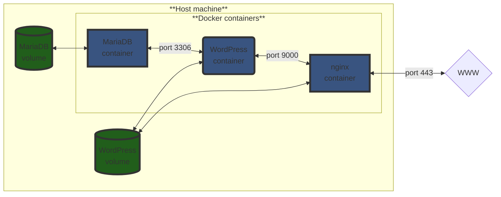

# INCEPTION

This is a project in the curriculum of Hive Helsinki / the 42 network. The main goal of this was to learn about docker and containers. The end result is a website.

## How to use

You will need sudo permissions to use this program. If it is not available to you, you will need to set up a virtual machine first.

1. Make sure that docker is installed on your system. If it is, using the following command should behave like this:

```bash
$ docker --version
Docker version 26.1.4, build 5650f9b
```

2. Then, add your user to the "docker" group:

```bash
$ sudo usermod -aG docker $USER
```
(If the docker group does not exist, you can create it with the below command:)

```bash
$ sudo groupadd docker
```

3. Clone this repository, navigate inside it, and use the 'make' command

```bash
$ git clone git@github.com:Lisly25/Inception.git Inception && cd Inception && make
```

The start-up process will take some time. You might also be prompted to enter your password. This is required to create the directory to hold the volumes for the mariadb and wordpress containers, and add the domain name to the /etc/hosts file

4. The website can now be visited at https://skorbai.42.fr (Note that even after step 3. finishes, it might take some time for the website to become available)

Note for usage on Windows/WSL:

For the domain name to be recognized, this line has to be added to ` c:\windows\system32\drivers\etc\hosts `

```
	127.0.0.1	skorbai.42.fr
```

## How to stop the program

### Suspending the program

Use the 'make down' command at the root of the repository

```bash
$ make down
```

This will just execute the docker compose down command. The wordpress website's files and the database contents will persist

### Remove the volumes

Using the 'make clean' command at the root of the repository will suspend the program, and remove the website files as well as the database contents (by removing the docker volumes from the host machine)

```bash
$ make clean
```

### Complete clean-up

Use the 'make fclean' command at the root of the repository to remove all files that the program added, reclaiming all memory that has been used

```bash
$ make fclean
```

## About the project

The fundamental idea is that the website is ran with the help of three docker containers. One of them is responsible for handling the database, another is for creating the wordpress website, while the third is hosting the website with nginx.

The database and the wordpress website's files mustn't be lost every time the system is restarted, so they are stored in docker volumes



### Docker compose file

Since the program requires three containers to work together, a docker compose was used to set it up.

The three containers are configured as three services.

```yaml
mariadb:
    container_name: mariadb
    build:
      context: ./requirements/mariadb
      dockerfile: Dockerfile
    image: mariadb:skorbai #The tag is important - otherwise, the official image would be pulled from dockerhub
    expose: #With this rule, the port is only exposed inside the docker network
      - 3306
    env_file:
      - ".env"
    volumes:
      - DB:/var/lib/mysql
    networks:
      - inception_network #All three services will be part of this
    restart: always
```

```yaml
wordpress:
    container_name: wordpress
    build:
      context: ./requirements/wordpress
      dockerfile: Dockerfile
    image: wordpress:skorbai
    expose: #With this rule, the port is only exposed inside the docker network
      - "9000"
    depends_on: #Determines the startup order of the containers
      - mariadb
      - nginx
    env_file:
      - ".env"
    volumes:
      - WordPress:/var/www/html
    networks:
      - inception_network
    restart: on-failure
```

```yaml
nginx:
    container_name: nginx
    build:
      context: ./requirements/nginx
      dockerfile: Dockerfile
    image: nginx:skorbai
    ports:
      - "443:443" # Since we want to be able to connect to this container from outside the docker network, it's important to bind it to a host port. Note that the "port" rule is used, not "expose"
    env_file:
      - ".env"
    volumes:
      - WordPress:/var/www/html
    networks:
      - inception_network
    restart: on-failure
```

The network doesn't require configuration (bridge is already the default driver), but it is important to declare it in the docker compose file

```yml
networks:
  inception_network:
    driver: bridge
```

For the volumes, we are specifying that they should be located in a specific directory within the host machine. This setup ensures that the contents are also copied back to the host (the ownership of teh volume directory also needs to be set with chown in the dockerfile)

```yml
volumes:
  DB:
    driver: local
    driver_opts:
      type: none
      device: /home/skorbai/data/database
      o: bind
  WordPress:
    driver: local
    driver_opts:
      type: none
      device: /home/skorbai/data/wordpress
      o: bind
```

### Dockerfiles

Instead of looking at the specific files, let's look at the rules in general:

```Dockerfile
FROM alpine:3.19.4
```

Determines the base image, which will be pulled from Dockerhub. The tag corresponds to a specific version

```Dockerfile
EXPOSE 9000
```

Technically not necessary, since this was also defined in the docker compose files.

```Dockerfile
WORKDIR /var/www/html
```

Determines the current working directory where commands will be executed by default. If not defined, will be root (/)

```Dockerfile
RUN apk update && apk add nginx bash openssl
```

Executes commands inside the container. `apk` is the alpine package manager. All containers run the `apk update` command before installing any packages. The `&&` between the updating and installing ensures that nothing is installed if the updating step fails

Another command that's also ran in all containers is `chmod` to ensure that the entrypoint scripts are set as executables

Some other commands might also be ran depending on the image. 

```Dockerfile
COPY ./conf/nginx.conf /etc/nginx/nginx.conf
```

Used to copy resources between the host machine and the container. Usually configuration files

```Dockerfile
ENTRYPOINT [ "nginx_start.sh" ]
```

Used to specify a command to be ran on container startup. In this setup, these are all bash scripts, that will set up the environment, and execute the actual programs that we need the containers for (mysqld from the mariadb container, php-fpm82 from wordpress, and nginx)

### How the containers work - entrypoint scripts and configuration files

#### MariaDB

This service did not depend on any other, so this is what I set up first. 

##### The configuration file

The mysql_install_db command in the entrypoint script will use these options (besides the mariaDB daemon)

```conf
user        = mysql
pid-file    = /var/run/mysqld/mariadb.pid
socket      = /var/run/mysqld/mysqld.sock
port        = 3306
basedir     = /usr
datadir     = /var/lib/mysql
tmpdir      = /tmp
skip-networking		= false #allows for reaching containers across the network
bind-address        = 0.0.0.0 # by default would only allow connections form localhost. This sets it to accept connections form any IP address

```

##### The entrypoint script

```bash
	echo "Executing setup script"

	echo "Initializing mariaDB data directory and creating system tables"

	#checking if the database has already been set up
	if test -d "/var/lib/mysql/mysql"; then
		echo "MariaDB already initialized"
	else
		mysql_install_db --datadir=/var/lib/mysql --group=mysql --user=mysql --skip-test-db
```

The `mysql_install_db` command initializes the MariaDB data directory and creates the system tables in the mysql database

The flags used:

+ `--datadir=/var/lib/mysql` : sets the path to the MariaDB data directory

+ `user=mysql`: can only be used by root as an option (Docker container processes do use root). This is the login user name to use for running mariadb. Files and directories created by mariadb will be owned by this user.

+ `--skip-test-db`: by default, a test database would be installed - this option skips that

This command also reads options from option files, including the one we provided

See also the documentation: https://mariadb.com/kb/en/mysql_install_db/

```bash
		mysqld --user=mysql --bootstrap << EOF
	FLUSH PRIVILEGES;
	ALTER USER 'root'@'localhost' IDENTIFIED BY '$MYSQL_ROOT_PASSWORD';
	CREATE DATABASE IF NOT EXISTS $MYSQL_DATABASE;
	CREATE USER IF NOT EXISTS '$MYSQL_USER'@'%' IDENTIFIED BY '$MYSQL_PASSWORD';
	GRANT ALL PRIVILEGES ON $MYSQL_DATABASE.* TO '$MYSQL_USER'@'%';
	FLUSH PRIVILEGES;
	EOF
```

Starts the MariaDB server daemon in bootstrap mode, which allows for running commands without starting the server

A heredoc is used to create the database for the wordpress website

('%' is a wildcard in this syntax)

The `ALTER USER` command is important: this prevents accessing the database without a password, even for the root user

#### Nginx

Nginx is used to host the website. It has access to the docker volume that contains the wordpress website's files

##### The configuration files

```nginx

events {} #The default settings are enough for us, so it's left empty

http { #even for https traffic, this context name is used

	server {
		#for ipv4 connections - only HTTPS is allowed
		listen 443 ssl;
		#for IPv6 connections - again, only HTTPS
		listen [::]:443 ssl;

		include /etc/nginx/snippets/self-signed.conf; #The contents of this file are as follows:

		#"ssl_certificate $CERTS_CRT;"
		#"ssl_certificate_key $CERTS_KEY;"

		include /etc/nginx/snippets/ssl-params.conf; # And the contents of this file:

		#ssl_protocols TLSv1.2 TLSv1.3; <-- very important, defines which protocols are supported
		#ssl_session_timeout  10m; <--  for how long a client may reuse session parameters
		#ssl_session_cache shared:SSL:10m; <-- session parameters are stored in a cache shared between all worker processes. See more in documentation: https://nginx.org/en/docs/http/ngx_http_ssl_module.html#ssl_session_cache
		#ssl_session_tickets off; <-- disables session resumption through TLS session tickets

		#The domain name
		server_name skorbai.42.fr;
		
		#The directory where the website files are found on the server machine - same directory as the docker volume
		root	/var/www/html;

		#Page that is displayed if the URL points to a directory - usually redirects elsewhere
		index	index.php;

		#This location context is used if the request URL doesn't match other locations
		location / {
			try_files $uri $uri/ /index.php?$args; #Checks for the existence of files in this order, return first one found. If none is found, the index.php is used
			index	index.php;
		}

		#Regular expression - means all files ending with .php
		location ~ \.php$ {
			fastcgi_pass wordpress:9000;#Our fastcgi server is the wordpress container
			fastcgi_index	index.php;
			include /etc/nginx/fastcgi.conf;#This configuration file is provided by nginx
		}
	}
	
}

```

##### The entrypoint script

```bash
echo "Checking if ssl certificate is present"

if test -f $CERTS_KEY; then
	echo "Certificate already generated"
else
	echo "No certificate. Generating..."
	openssl req -x509 -nodes -days 365 -newkey rsa:2048 -keyout $CERTS_KEY -out $CERTS_CRT -subj "/CN=$DOMAIN_NAME"

	echo "Certificate successfully generated"

	echo "Adding certificate location info to self-signed.conf"

	echo  "ssl_certificate $CERTS_CRT;" >> /etc/nginx/snippets/self-signed.conf
	echo "ssl_certificate_key $CERTS_KEY;" >> /etc/nginx/snippets/self-signed.conf

fi

echo "Nginx configuration done. Starting nginx"

#Replaces current process with nginx (running in the foreground), becoming PID 1
exec nginx -g 'daemon off;'
```

The openssl command is what generates the SSL certificate

+ `req -x509`: SSL and TLS uses this specific X.509 public key infrastructure. The `-x509` is used to make the certificate self-signed

+ `-nodes`: setting to avoid needing a password

+ `days 365`: the length of the certificate's validity

+ `-newkey rsa:2048`: the key is generated at the same time as the certificate. The key will be a 2048-bit long RSA key

+ `-keyout $CERTS_KEY`: the private key will be saved to the location specified by the environmental variable

+ `out $CERTS_CRT`: the certificate will be saved to the location specified by the environmental variable

+ `subj "/CN=$DOMAIN_NAME"`: Normally, we'd be prompted to fill out a form with info such as country name, organization name, etc. These will be left empty, except for the common name, that we set here to be the domain name

In the end, the `nginx -g daemon off` will start nginx in the foreground

#### Wordpress

##### The configuration file

```conf
[www]

#nobody is a special user: used for things that don't need special permissions
#Usually reserved for vulnerable services, so that if they get hacked, they'll have minimal damage on the system
user = nobody
group = nobody

#The required port
listen = 9000


pm = dynamic #mandatory parameter: there will always be at least 1 child process. Their number can increase dynamically based on the following directives
pm.max_children = 5
pm.start_servers = 2
pm.min_spare_servers = 1
pm.max_spare_servers = 3

request_terminate_timeout = 300s #Max time for a child to be serving a single request. If it is exceeded, the child is killed
```

##### The entrypoint script

```bash
until mysql --host=mariadb --user=$MYSQL_USER --password=$MYSQL_PASSWORD --execute="SELECT 1"; do
    echo "Waiting for database to start up"
    sleep 3
done
```

Makes the script wait for the mariaDB setup to be complete before continuing

```bash
if test -f wp-config.php; then
    echo "Wordpress has already been set up"
else
    echo "Downloading WP-CLI"

    curl -O https://raw.githubusercontent.com/wp-cli/builds/gh-pages/phar/wp-cli.phar

    echo "Creating WP-CLI command utility"

    chmod +x wp-cli.phar
    mv wp-cli.phar /usr/local/bin/wp

    echo "Checking WP-CLI installation"

    wp --info

    if [ $? -eq 0 ]; then
        echo "WP-CLI successfully installed"
    else
        echo "WP-CLI installation failed. Exiting..."
        exit 1
    fi
```

Downloading wordpress command line tool according to official instructions: https://make.wordpress.org/cli/handbook/guides/installing/#recommended-installation

`wp --info` is used to check if the installation was successful - if not, the script exits

```bash
    echo "Downloading wordpress"

    wp core download --allow-root
```

Downloads and extracts Wordpress core files to /var/www/html (which was set as the working directory in the Dockerfile). Normally, this, and many other wp commands cannot be used with the root user, but that is exactly what we'll be doing: so we circumvent this restriction with the `--allow-root` flag.

This is not a safe practice by itself: but note that the php processes will be ran under the `nobody` user, *not* `root`, as specified in the www.conf file

```bash
    echo "Generating wordpress config file"


    wp config create --allow-root --dbhost=mariadb --dbname=$MYSQL_DATABASE --dbuser=$MYSQL_USER --dbpass=$MYSQL_PASSWORD
```

Creates a new wp-config.php file.

Note that we didn't use the admin user of mysql here
Also, `--dbhost=mariadb` would not accept using just the container name if the docker network wasn't set up correctly

```bash
    echo "Installing wordpress"

    wp core install --url=$DOMAIN_NAME --title="Inception" --admin_user=$WP_ADMIN_USERNAME --admin_password=$WP_ADMIN_PASS --admin_email=$WP_ADMIN_EMAIL --allow-root
```

Creates the wordpress tables in the database

```bash
    echo "Checking if the normal user already exists"

    if wp user get "$WP_NORMAL_USERNAME" --allow-root; then
        echo "User already exists"
    else
        echo "No such user yet. Adding it now"
        wp user create "$WP_NORMAL_USERNAME" "$WP_NORMAL_EMAIL" --role=author --user_pass="$WP_NORMAL_PASS" --allow-root
    fi
```

Creating a second user

```bash
    chmod o+w -R /var/www/html/wp-content

    echo "Starting the server"
    
fi

exec php-fpm82 -F
```

the `chmod o+w -R /var/www/html/wp-content` command ensures that everyone has write permissions for the specified directory, which will also hold uploads by users

Wordpress websites use PHP. `php-fpm` (a.k.a FastCGI process manager) is a processor for PHP: since PHP is a high-level language, it needs to be compiled before a web server can use it. PHP-FPM is a specific variant which was designed to be able to handle heavy loads. Wordpress websites tend to use this as their PHP processor.

We need this to be the running process in this container: nginx will redirect traffic here if necessary

## Useful docker commands for debugging

To show the complete log of the stdout of the container:

```bash
$ docker logs <container_name>
```

To run a command inside the container in interactive mode:

```bash
$ docker exec -it <container_name> <command>
```

This command can be `mysql` for example, to check the mariadb database, or even `bash`

To look at the logs from nginx, you first have to use the above command to get a shell from the container

With my configuration, this is where the error and access log are found (this is the default), but this is something that can be changed in the nginx configuration file

```bash
$ docker exec -it nginx bash
$ cd /var/log/nginx
```

To list all the networks:

```bash
$ docker network ls
```

To filter the output of docker ps based on which network the containers are connected to:

```bash
$ docker ps --filter network=<network id, full or partial>
```

To list all volumes:

```bash
$ docker volume ls
```

Deleting a volume:

```bash
$ docker volume rm <volume name>
```

To filter the output of docker ps based on whether a specific volume is mounted to them:

```bash
$ docker ps --filter volume=<volume name>
```

## MariaDB cheat sheet

Some basic commands to verify that the database has been set up correctly

Access mariadb with specific user:

```bash
$ mysql -u <username> -p <database>
```

You will be prompted for the password after this.

You could also enter the password in the command following the -p flag without spaces between them, like this:

```bash
$ mysql -u <username> -p<password> <database>
```

but this is considered insecure, since the password is in plain text, and anyone who can look at your command history on the server could see it

Show list of databases:

```
SHOW DATABASES;
```

To work on a specific database:

```
USE <database>
```

To list the tables in a database (make sure to use the USE command first):

```
SHOW TABLES;
```

To look at all the entries in a database:

```
SELECT * FROM <table>;
```

## Disable automatic redirect to HTTPS in Firefox

A specific requirement of the project was that it should be impossible to connect to the site with plain HTTP. However, Firefox by default changes the URL to HTTPS. To turn off this behaviour for testing purposes:

1. paste `about:config` to the address bar and press enter to bring up configuration options

2. set `network.stricttransportsecurity.preloadlist` to `false`

3. set `browser.fixup.fallback-to-https` to `false`

(This solution was found at https://stackoverflow.com/questions/30532471/firefox-redirects-to-https)