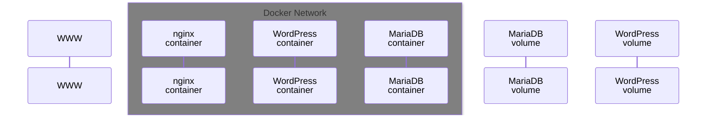

# INCEPTION

This is a project in the curriculum of Hive Helsinki / the 42 network. The main goal of this was to learn about docker and containers. The end result is a website.

## How to use

You will need sudo permissions to use this program. If it is not available to you, you will need to set up a virtual machine first.

1. Make sure that docker is installed on your system. If it is, using the following command should behave like this:

```bash
$ docker --version
Docker version 26.1.4, build 5650f9b
```

2. Then, add your user to the "docker" group:

```bash
$ sudo usermod -aG docker $USER
```
(If the docker group does not exist, you can create it with the below command:)

```bash
$ sudo groupadd docker
```

3. Clone this repository, navigate inside it, and use the 'make' command

```bash
$ git clone git@github.com:Lisly25/Inception.git Inception && cd Inception && make
```

The start-up process will take some time. You might also be prompted to enter your password. This is required to create the directory to hold the volumes for the mariadb and wordpress containers, and add the domain name to the /etc/hosts file

4. The website can now be visited at https://skorbai.42.fr (Note that even after step 3. finishes, it might take some time for the website to become available)

## How to stop the program

### Suspending the program

Use the 'make down' command at the root of the repository

```bash
$ make down
```

This will just execute the docker compose down command. The wordpress website's files and the database contents will persist

### Remove the volumes

Using the 'make clean' command at the root of the repository will suspend the program, and removed the website files as well as the database contents (by removing the docker volumes from the host machine)

```bash
$ make clean
```

### Complete clean-up

Use the 'make fclean' command at the root of the repository to remove all files that the program added, reclaiming all memory that has been used

```bash
$ make fclean
```

## About the project

The fundamental idea is that the website is ran with the help of three docker containers. One of them is responsible for handling the database, another is for creating the wordpress website, while the third is hosting the website with nginx.

The database and the wordpress website's files mustn't be lost every time the system is restarted, so they are stored in docker volumes


